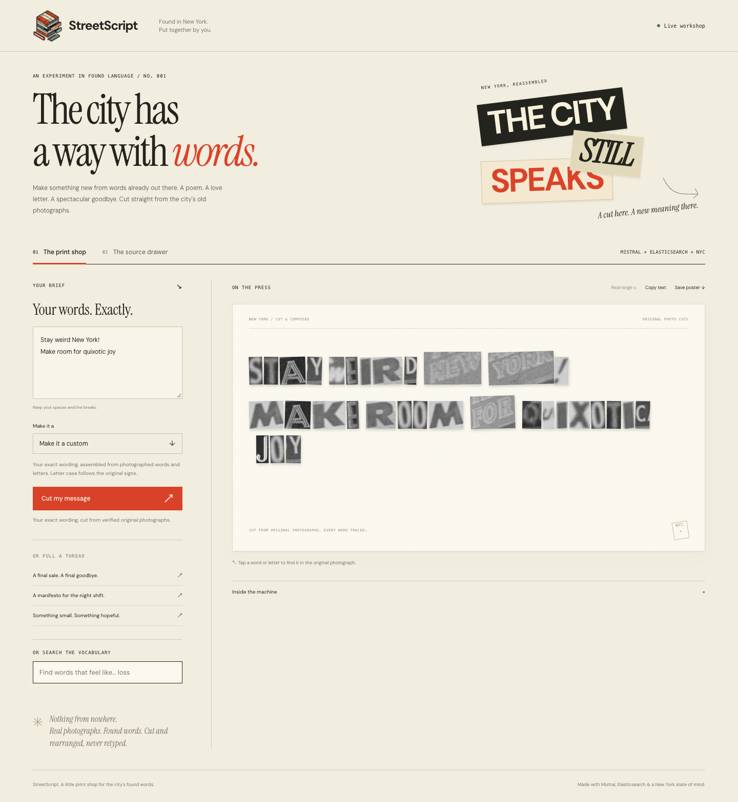

# NYC Cut-Up Machine

**Write something new using only words New York put on its buildings.**

A found-poetry print shop built for the [Elastic × Mistral NYC Hack Night](https://github.com/AvenueJ/elastic-mistral-hacknight). It retrieves words from historical NYC storefront photographs and assembles a poem or letter from **actual photographic cutouts**. Click a cutout to see its exact location in the original picture. Export a standalone SVG poster with embedded photographs and archive credits.

Mistral reads and composes. Elasticsearch finds words and a reusable photographic alphabet. Application code checks every cutout.



## Quick start

Requires **Python 3.11+**. The app has no Python package dependencies. Preparing new photographic word locations also requires **Tesseract** (tested with 5.5.2). Letter preparation currently uses Tesseract and the macOS `sips` utility; serving already-prepared crops does not require either tool.

```sh
git clone https://github.com/Paradox560/nyc-cut-up-machine.git
cd nyc-cut-up-machine
python3 -m cutup --demo
```

Open **http://127.0.0.1:8765**. Demo mode uses explicitly synthetic vocabulary and fixed compositions for each form. It makes no API calls and does not pretend to interpret a freeform brief or use historical evidence.

## Connect the real services

```sh
cp .env.example .env.local
# Fill in the three credentials locally, then:
python3 -m cutup check
```

| Setting | Value |
| --- | --- |
| `MISTRAL_API_KEY` | A Mistral API key with inference access |
| `ELASTICSEARCH_URL` | The Elasticsearch HTTPS endpoint, not a Kibana URL or Cloud ID |
| `ELASTICSEARCH_API_KEY` | An encoded API key with create-index, document write, read, and index metadata permissions for this project's index |
| `ELASTICSEARCH_INDEX` | Defaults to `nyc-cut-up-machine`; use a dedicated index |
| `MISTRAL_CHAT_MODEL` | Defaults to `ministral-3b-2512`; choose a model your account has inference quota for |
| `MISTRAL_OCR_MODEL` | Defaults to `mistral-ocr-latest` |
| `MISTRAL_EMBED_MODEL` | `mistral-embed` (1,024 dimensions) |
| `MISTRAL_VOICE_ID` | Optional saved Mistral voice; enables spoken compositions |

`.env.local`, downloaded images, corpus data, and generated work are ignored by Git. Credentials stay in the Python process and are never sent to the browser. Environment variables override the local file. Settings are reloaded on each web request.

### Load NYC photographs

The manifest contains verified Municipal Archives item records, ordered with legible Manhattan storefronts first. Start small:

```sh
python3 scripts/ingest.py --limit 3 --download-only
python3 scripts/ingest.py --limit 3
python3 -m cutup
```

Open **Source drawer**. Inspect each image, correct the transcription, keep only clearly visible storefront words, and mark the source reviewed. Saving a review embeds the corrected text and writes it to Elasticsearch. Index all already-ingested sources with `python3 -m cutup index`.

Next, locate the words in the actual images:

```sh
python3 scripts/localize.py
# Open data/archive/localization/review.html in a browser.
# Check only correctly framed words, then download the accepted crop IDs.
python3 scripts/localize.py --accept /path/to/accepted-crop-ids.json
python3 -m cutup index
```

Tesseract proposes exact-word bounding boxes; the review sheet shows the original pixels. Skewed or faint historical signs may need manually measured boxes, or can be omitted. Live composition uses only words with accepted locations. Editing a source transcription invalidates its locations, so localize and index that source again after corrections.

Prepare a reusable letter drawer from those words:

```sh
python3 scripts/extract_letters.py
# Open data/archive/letters/atlas.html; check the correctly framed letters.
python3 scripts/extract_letters.py --accept /path/to/accepted-letter-ids.json
python3 -m cutup index
```

Tesseract supplies actual character boundaries inside correctly recognized word crops. Letters are never guessed by dividing a word into equal-width strips. Rare letters can be located manually and inspected in the same atlas. Every accepted character is bound to an original image fingerprint and exact pixel coordinates.

The full manifest includes additional Manhattan storefronts with richer signage; increase `--limit` to ingest those. Review state is preserved on ordinary re-ingestion. The explicit OCR refresh option resets it. See [archive ingestion and attribution](docs/ARCHIVE.md) for details.

If your account has vision/chat quota but its OCR API is rate-limited, select the explicit vision-transcription path:

```sh
python3 scripts/ingest.py --limit 18 --transcription-method vision
```

This uses the configured vision-capable chat model. Sources retain the actual transcription method and model; the app does not call this OCR API output. Model listing access alone does not prove that the account has inference quota for every listed model.

For a custom collection, copy the schema in `data/seeds.json` and use `--manifest path/to/manifest.json`. Downloads are restricted to the Municipal Archives host, checked as JPEG/PNG, bounded in size, and requested politely. Images remain local, not in this source repository.

### Make a print

1. Describe the feeling or purpose: “a breakup letter that sounds like a shop closing.”
2. Choose poem, love letter, breakup letter, or manifesto. Choose **Make it a custom** to supply your own exact message instead.
3. **Cut it together** retrieves source vocabulary and composes with Mistral.
4. Click a word to inspect its enlarged cutout and highlighted rectangle in the original photograph.
5. Copy the words or export a standalone SVG containing the same photo pixels.

Whole photographed words are preferred. When a word is unavailable, the machine spells it with photographed letters, each independently linked to its source. Generated forms use Mistral to write; custom mode preserves your wording and line breaks without a chat-model rewrite, and still uses Mistral embeddings with Elasticsearch retrieval. Custom messages can contain up to 300 characters. Visible letter case follows the original signs; copying text preserves your exact input.

The prepared demo alphabet covers A–Z. Punctuation and digits require their own genuine crops; unavailable characters produce an explicit error, never a font substitute. The source drawer separately reports downloaded photographs, reviewed photographs, whole-word crops, and letter crops.

## How it works

```text
NYC Municipal Archives + selected Library of Congress photographs
        ↓ Mistral / recorded visual transcription → review → word and letter localization
Elasticsearch: source metadata + text + word/letter coordinates + Mistral embeddings
        ↓ BM25 and vector search combined with RRF
Mistral writes a short composition / custom mode preserves your exact message
        ↓ strict word, crop-boundary, and original-image fingerprint checks
Original photograph pixels → cutout collage → highlighted evidence / embedded SVG
```

- **Search is essential:** live compositions retrieve vocabulary from Elasticsearch using both lexical and semantic ranking. It is not an incidental log store.
- **Provenance is enforced:** every displayed fragment resolves to a verified word or letter crop. When the letter drawer exists, Mistral may compose new words, but every character must be physically available in a reviewed photograph. Without a letter drawer, the original word-only enum constraint remains. Unknown characters, forged crop IDs, stale transcriptions, malformed output, and excess length are rejected.
- **Review is separate from code validation:** proving a word exists in OCR does not prove the OCR is right. Live UI compositions use reviewed sources only.
- **Pixels, not retyping:** every live word is a bounded viewport into its original JPEG/PNG. Both server and browser verify the image fingerprint; the browser also checks decoded dimensions. A missing crop or changed image produces an error. Export embeds each used original once and preserves crop coordinates, source links, and attribution.
- **Snapshots survive edits:** each saved composition contains its source evidence at creation time. Later source corrections do not silently rewrite old prints.
- **No quiet fallback:** live provider failures produce errors. They do not turn into synthetic poems labeled as live output.
- **Optional voice:** Voxtral reads an existing verified composition when `MISTRAL_VOICE_ID` is configured. No browser TTS is substituted.

## Development

```sh
python3 -m unittest discover -s tests
node --check web/app.js
```

Tests cover word and crop provenance, image fingerprints, invalid model output, source corrections, localization, persistence, ingestion validation, API boundaries, and review/index synchronization. Tests do not require paid services; live service checks are explicit commands.

See [the three-minute demo script](docs/DEMO.md). The frontend is plain browser JavaScript and CSS; the backend uses Python's standard library. This is a local hackathon application, bound to loopback. Public deployment would need authentication, request limits, and a production HTTP server.

See [the NYC dataset guide](docs/DATASETS.md) for the larger Municipal Archives collection, NYPL alternatives, and the Library of Congress source used to complete the alphabet. The municipal importer remains restricted to its approved host; the individually reviewed LOC item is documented in `data/loc-seed.json`.

## Data and credits

Photographs: **1940s Tax Department photographs, Courtesy of the Municipal Archives, City of New York.** Each item also preserves its title, source URL, borough, block, and lot. Consult each archive record's rights information before redistributing images. The code repository contains metadata and source code, not a republished photograph collection.

The project is inspired by the hackathon's [tax-photo starter notebook](https://github.com/AvenueJ/elastic-mistral-hacknight/blob/main/nyc_tax_photos.ipynb). Historical record dates describe the collection; the app does not infer current businesses, ownership, or whether a building survives today.
